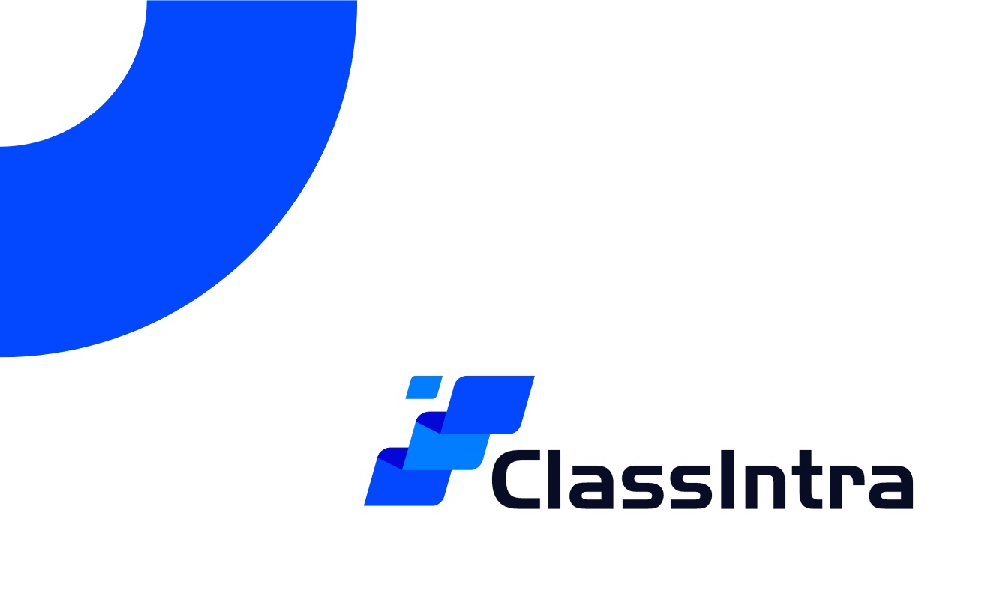

<p align="center">
  
</p>

<h1 align="center">ClassIntra 便携版（一键启动形态）</h1>
<p align="center"><strong>校园内网 WebOS + 热点劫持 · 一个 bat 全流程</strong> — 无需外网、无需安装，双击即运行</p>

<div align="center">

[](https://github.com/ClassIntra/ClassIntra)
[](https://github.com/ClassIntra/captive)
[](LICENSE)

</div>

---

## 这是什么

把 **ClassIntra**（校园内网 WebOS，MIT）与 **captive** 热点劫持组件（MIT，含本地增强）打包成一个绿色便携工程。最终交付形态收敛为**一个入口脚本**：

> **双击 `一键启动.bat` —— 自动提权 → 起 ClassIntra → 准备防火墙 → 绑 53 → 自动开热点 → 看门狗守护，全程无需手动操作。**

教师机开热点后，学生平板访问畅言（changyan.com）等域名时，在 DNS + HTTPS 层被劫持到本机 ClassIntra（`http://localhost:9001`），学生设备零配置、不需要外网。

## 为什么热点要在 captive 之后开（重要机制）

Windows「移动热点」由 ICS（Internet Connection Sharing）驱动，ICS 自带的 DNS 代理会占 `0.0.0.0:53` —— 正是 captive 要劫持 DNS 的端口，**谁先绑到谁说了算**。所以顺序固定为：

```
captive 绑定 UDP 53  →  热点随后自动打开
（ICS 抢不到 53，但热点本身照常起来 —— 实测验证）
```

旧版「先开热点再启动 captive」的顺序因此作废，`一键启动.bat` 内已固化正确顺序，并由 `captive/watchdog.ps1`（每 20s）守护 ClassIntra 进程与热点状态。

## 目录结构

```
classintra-portable/
├─ 一键启动.bat                 唯一入口（自动提权，前台窗口运行，关窗即全停）
├─ 提取云盘文件.bat             一键导出 ClassIntra 云盘全部文件（调 tools/export-cloud.js）
├─ captive-使用说明.txt         captive 劫持 + 一键启动的完整使用说明（UTF-8）
├─ captive/                     热点劫持运行件（自研封装，随包分发）
│  ├─ hotspot-redirect.js       DNS 53 拦截 + HTTPS 443 反代 + HTTP 80 跳转
│  ├─ hotspot-ctl.ps1           开/关/查 Windows 热点（支持等待 UDP 53 就绪）
│  └─ watchdog.ps1              进程守护 + 热点监控
├─ tools/                       自研辅助脚本
│  ├─ relink.js                 便携包移动后自动修复 node_modules 链接
│  ├─ make-env.js               首次运行生成 server\.env
│  ├─ export-cloud.js           云盘文件全量导出
│  ├─ copy-out.js               导出辅助
│  └─ node_modules-manifest.json 依赖清单（relink 校验用）
├─ apps/                        上游源码快照（MIT）
│  ├─ ClassIntra/               上游 ClassIntra（含 .npmrc 国内镜像增强）
│  └─ captive/                  上游 captive（含智学网域名增强）
├─ scripts/                     证书生成/检查、开机自启（旧形态辅助，可选）
├─ docs/                        便携版操作说明、captive 说明
└─ LICENSE                      MIT（含上游版权声明）
```

## 运行时布置（不入库的部分）

以下内容体积大或含个人数据，**不入库**（见 `.gitignore`），部署时按下表放入/生成：

| 路径 | 内容 | 来源 |
|---|---|---|
| `runtime\node\node.exe` | 便携 Node.js（Windows x64） | [nodejs.org](https://nodejs.org/dist/) 解压放入 |
| `runtime\node_gui\node.exe` | GUI 子系统 node（可选，ClassIntra 主进程用它免窗口；缺失时自动回退 `runtime\node`） | 同上，另放一份 |
| `server\` | ClassIntra 服务端（由 `apps\ClassIntra` 源码构建：装依赖 → 构建 → 拷出 `server\`） | 见 docs/便携版使用说明.txt |
| `client\dist\` | 前端构建产物 | 构建生成 |
| `apps\`（本包根） | WebOS 应用集（admin/music/notes/timetable/…） | 随包 |
| `Resources\` | 课表 `kb.yml`、音乐、照片、视频等 | 随包（个人数据不入库） |
| `market-apps\`、`logs\` | 应用市场下载页 / 运行日志 | 运行时生成 |
| `captive\certs\` | HTTPS 证书（`cert.pem`/`key.pem`） | `scripts/gen-cert.js` 首次运行生成，**私钥绝不入库** |
| `server\.env` | 端口、管理员班管 ID 等配置 | `tools\make-env.js` 首次生成后手改 |

## 快速开始

1. 克隆本仓库，按上表放入 `runtime\`、`server\` 等
2. 双击 **`一键启动.bat`**（UAC 弹窗点「是」），等它跑完 4 步
3. 浏览器打开 `http://localhost:9001`；学生平板连上本机热点即被自动引到 ClassIntra
4. 关闭命令窗口（或 Ctrl+C）即全部停止；热点不会自动关，需要手动关

首次配置（管理员班管 ID、课表 `Resources\public\kb.yml` 的改法）见 **`captive-使用说明.txt`** 与 `docs\便携版使用说明.txt`。

## 从云盘导出文件

双击 `提取云盘文件.bat`：用内置 node 调 `tools/export-cloud.js`，把 ClassIntra 云盘里的全部文件拉到本地导出目录并自动打开（支持把参数透传给脚本）。

## 常见问题

- **双击没反应/报缺权限** → 必须 UAC 提权；若上次有提权残留进程占着 53/443，脚本会先清理。
- **提示找不到 `runtime\node\node.exe`** → 未放入运行时，见上表。
- **443 被占用**（常见：Watt Toolkit/Steam++ 的加速） → 关掉占用者再启动，脚本会给出占用提示。
- **学生页面打不开/一直转圈** → 先看 `logs\` 下四个日志；典型坑与排查顺序见 `docs\captive-说明.txt`。
- **cmd 窗口中文乱码？** → `.bat` 采用 GBK（ANSI）以兼容 Windows 命令行；GitHub 网页预览乱码属正常，不影响运行。`README`/`docs`/`tools/*.js` 均为 UTF-8。

## 关于旧版「编号多步骤 bat」

早期版本按「1-安装初始化 → 2-启动 → 5.2 守护安装 → 9-安全退出」分步操作，已整体被 `一键启动.bat` 取代并从仓库移除——需要回看请在 git 历史中找（最后一次包含它们的提交）。`scripts/` 里的开机自启脚本仍可单独使用（可选）。

## 与上游的关系 / 本地增强

| 目录 | 上游 | 本仓库相对上游的改动 |
|---|---|---|
| `apps/ClassIntra` | [ClassIntra/ClassIntra](https://github.com/ClassIntra/ClassIntra) `5c93e6a` | `.npmrc` 国内镜像（registry/better-sqlite3 预编译）与便携注释 |
| `apps/captive` | [ClassIntra/captive](https://github.com/ClassIntra/captive) `559b37d` | 拦截域名加入 `zhixue.com`；便携 node 适配；`hotspot-ctl.ps1`/`watchdog.ps1` 为自研封装（上游没有） |

## License

MIT。上游版权归各自作者所有（见 [LICENSE](LICENSE) 与 `apps/*/LICENSE`）。
